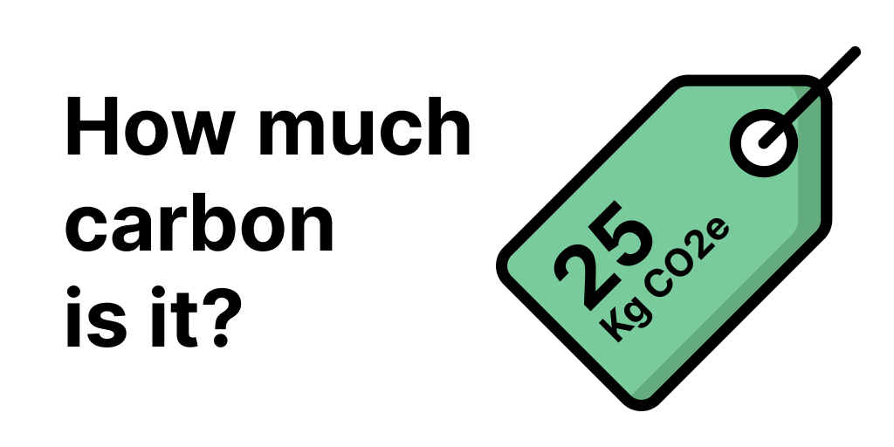

# Carbonfact Models



This repository contains the carbon footprint models used by [Carbonfact](https://www.carbonfact.co).

## Disclaimer

This repository is in its early days. Please be indulgent, we're progressively improving it to make it easier to understand, re-use and contribute to.

If you have questions, please have a look at [the main website](https://www.carbonfact.co) and contact us at [hello@carbonfact.co](mailto:hello@carbonfact.co).

## How to use

This repository is intended for:

- Explaining how the carbon footprint calculation is done on [Carbonfact](https://www.carbonfact.co).
- Enabling anyone to audit or reuse our methodology.

For now, we are sharing the source code used on our platform to calculate the carbon footprints. We share it as open-source using a [simple copyleft license](https://www.mozilla.org/en-US/MPL/2.0/FAQ/) so that it may be reused but any improvement to the model must be shared with the community (by us and others).

To be able to understand how the model works, you will need basic knowledge in software programming and the Typescript language. (We intend to make this easier to understand for non-programmers in the future.)

**Tests**

Test files have been added (ending with `.test.js`). You can start by looking at them to understand how to use the different parts of the source code.

**Run locally**

```sh
git clone https://github.com/kansoapp/carbonfact-models
cd carbonfact-models
yarn install
yarn test
```

## How it works

**[Engine](./src/calculation/engine.ts)**

- The carbon footprint is calculated in here, by the `computeFootprint(productData: ProductData)` method.
- The `ProductData` type represents the data necessary to perform the computation. It is defined in [src/model/types.ts](./src/model/types.ts).

**[Templating](./src/calculation/templating.ts)**

_Introduced in `v0.2.0`_

> When calculating the carbon emissions of a pair of sneakers for which we don't have the weight of the upper, we apply a template (which may be based on the shoes' brand and category) that provides this value. The template may be used to determine any value of the data necessary to compute the footprint.

- Since we may not have exhaustive data for all the products we want to estimate the carbon footprint for, we use a templating system.
- The templating system will _expand_ a partial product data using a specific template.
- The templates' data is defined in [productTemplates.ts](./src/data/productTemplates.ts).

## Included data

The emission factors and model parameters used in our calculation engine are defined in [parameters.ts](./src/model/parameters.ts).

They are mostly:

**Emission factors**

- The most important parameters of the calculation! They determine how much carbon-equivalent emissions a given material or component represents. For example, how much CO2eq a kg of recycled cotton made in Spain emits.
- Emission factors are defined in [parameters.ts](./src/model/parameters.ts), prefixed by `emissionFactor`.

**Model parameters**

- For some parts of the carbon footprint assessment, it is less important to have a very detailed analysis (e.g. the most important part - in terms of CO2eq emissions - of the life-cycle of a pair of shoes is the materials it's made of). For those, we may rely on model parameters which provides high-level approximates of the emissions (e.g. the distribution step).
- Those parameters are defined in [parameters.ts](./src/model/parameters.ts), prefixed by `fixedValue`.

Data-owner? Reach out if you have any remark or question on how we use your data.

## Contribute

If you see errors or want to suggest improvements, feel free to submit Github issues.

**Data owners**

- You own data that may help us in our assessment (e.g. emission factors) and would like to share them with us?
- We use some of your data and you have any remark?

👉 contact us on [hello@carbonfact.co](mailto:hello@carbonfact.co)

## TODOs

- [x] Explain how to use it
- [ ] Explain how it's used by Carbonfact
- [ ] Detail sources of model parameters
- [ ] Explain how to contribute
- [ ] Add a code of conduct
- [x] Add tests
- [ ] More tests and automated built in CI

---

Copyright © Kanso Inc. 2021
